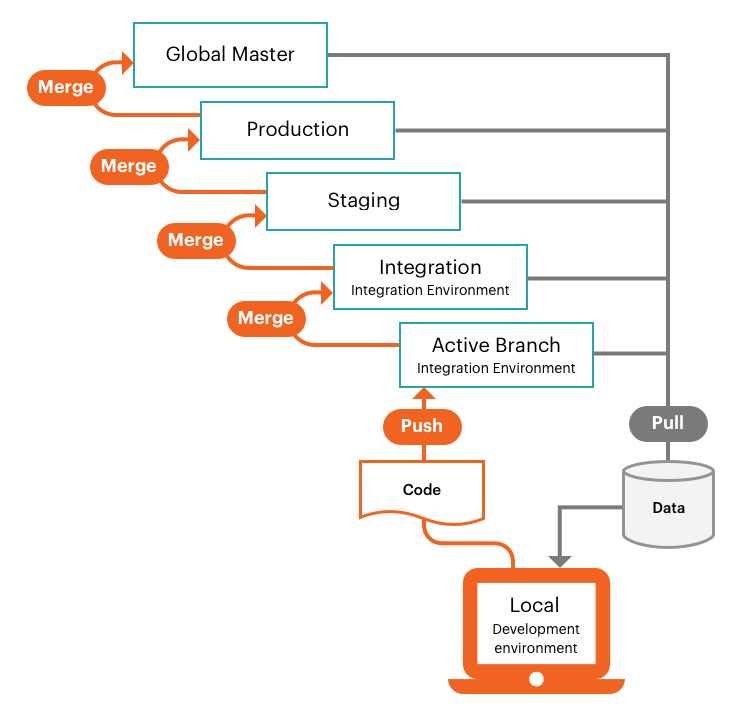

# Arbetsflöde för Pro-projekt

Pro-projektet innehåller en enda Git-databas med en global `master`-gren och tre huvudmiljöer:

1. **Produktionsmiljö** för att starta och underhålla den publicerade webbplatsen
1. **Mellanlagringsmiljö** för testning med alla tjänster
1. **Integrationsmiljö** för utveckling och testning


De här miljöerna är `read-only`, och godkänner bara distribuerade kodändringar från grenar som skickats från den lokala arbetsytan.

I följande bild visas arbetsflödet för Pro-utveckling och -distribution, som använder en enkel Git-förgrening. Du [utvecklar](#development-workflow)-kod med en aktiv gren baserad på `integration`-miljön, _push_- och _pull_-kodsändringar till och från din aktiva fjärrgren. Du distribuerar verifierad kod genom att _sammanfoga_ fjärrgrenen till basgrenen, vilket aktiverar en automatiserad [bygg- och distributionsprocess](#deployment-workflow) för den miljön.



Eftersom miljön är skrivskyddad kan du inte göra några kodändringar direkt i molnmiljön. Om du försöker köra `composer install` för att installera några moduler visas ett fel, till exempel:

```bash
file_put_contents(...): Failed to open stream: Read-only file system  
The disk hosting /app/<cluster_ID> is full
```

Mer information finns i [Pro-arkitektur](pro-architecture.md) för en översikt över Pro-miljöer, och i [[!DNL Cloud Console]](../project/overview.md#cloud-console) finns en översikt över Pro-miljölistan i projektvyn.

## Arbetsflöde för utveckling

Integreringsmiljön tillhandahåller en enda `integration`-bas-gren som innehåller din Adobe Commerce på molninfrastrukturkoden. Du kan skapa ytterligare en aktiv miljögren. Detta tillåter upp till två aktiva grenar som distribueras till plattformsbehållare (PaaS). Det finns ingen gräns för hur många inaktiva miljöer det finns, men ju mer inaktiva miljöer det finns desto längre tid tar det för molnkonsolen att läsa in.

{{enhanced-integration-envs}}

Projektmiljöerna har stöd för en flexibel, kontinuerlig integrationsprocess. Börja med att klona grenen `integration` till din lokala projektmapp. Skapa en gren, eller flera grenar, utveckla nya funktioner, konfigurera ändringar, lägga till tillägg och distribuera uppdateringar:

- **Hämta** ändringar från `integration`

- **Förgrening** från `integration`

- **Utveckla** kod på en lokal arbetsstation, inklusive [!DNL Composer] uppdateringar

- **Skjut in**-koden ändras till fjärrkoden och validera

- **Koppla** till `integration` och testa

Med en utvecklad kodgren och motsvarande konfigurationsfiler är dina kodändringar klara att sammanfogas med grenen `integration` för mer omfattande testning. Miljön `integration` passar också bäst för:

- **Integrerar tredjepartstjänster** - Alla tjänster är inte tillgängliga i PaaS-miljön.

- **Genererar konfigurationshanteringsfiler** - Vissa konfigurationsinställningar är _skrivskyddade_ i en distribuerad miljö.

- **Konfigurerar din butik** - Du bör konfigurera alla butiksinställningar fullständigt med integreringsmiljön. Du hittar **Administratörs-URL:en för** i _integreringsvyn_ i _[!DNL Cloud Console]_.

## Arbetsflöde för distribution

Varje gång du skickar kod från din lokala arbetsstation till fjärrmiljön eller lägger samman kod till en miljögren genererar skripten ny kod och tillhandahåller de konfigurerade tjänsterna till fjärrmiljön.

Skapa skriptåtgärder:

- Webbplatsen i målmiljön fortsätter att köras under en bygge

- Kontrollera och kör Adobe Commerce på korrigeringar och snabbkorrigeringar för molninfrastruktur

- Kompilera kod med en bygg- och distributionslogg

- Kontrollera om det finns Configuration Management, statisk innehållsdistribution sker under den här fasen

- Skapa eller använd en instruktionsmarginal med oförändrad kod för att snabba upp processen

- Tillhandahåller alla backend-tjänster och program

Distribuera skriptåtgärder:

- Placera platsen i målmiljön i _underhållsläge_

- Distribuera statiskt innehåll om det inte slutförs under bygget

- Installera eller uppdatera Adobe Commerce i molninfrastrukturen

- Konfigurera routning för trafik

Efter bygg- och distributionsprocessen kommer din butik tillbaka online med dina senaste kodändringar och konfigurationer. Se [Distributionsprocess](../deploy/process.md).

### Sammanfoga till integration

Kombinera alla verifierade kodändringar genom att slå samman din aktiva utvecklingsgren med basgrenen `integration`. Du kan testa alla ändringar i `integration`-grenen innan du befordrar ändringar i mellanlagringsmiljön.

### Sammanfoga till mellanlagring

Mellanlagring är en förproduktionsmiljö som tillhandahåller alla tjänster och inställningar så nära produktionsmiljön som möjligt. Flytta alltid dina kodändringar från miljön `integration` till miljön `staging` så att du kan utföra grundliga tester med alla tjänster. Första gången du använder testmiljön måste du konfigurera tjänster som [Fast CDN](../cdn/fastly.md) och [New Relic](../monitor/new-relic-service.md). Konfigurera betalningsgatewayar, leveranser, meddelanden och andra viktiga tjänster med sandlåda eller testningsreferenser.

Det är bäst att noggrant testa alla tjänster, verifiera prestandatestningsverktygen och utföra UAT-tester som administratör och kund tills du känner att butiken är redo för produktionsmiljön. Se [Distribuera din butik](../deploy/staging-production.md).

{{second-staging}}

### Koppla till produktion

Efter grundlig testning i staging-miljön kan du slå samman till produktionsmiljön och grundligt testa med Live-inloggningsuppgifter. Så fort ni lanserar er produktionsplats måste kunderna kunna slutföra sina inköp och administratörerna måste kunna hantera livebutiken. Se följande avsnitt för en detaljerad och tydlig genomgång av hur du distribuerar butiken och publicerar den:

- [Distribuera din butik](../deploy/staging-production.md)
- [Starta webbplatsen](../launch/overview.md)

### Sammanfoga till global mallsida

Skicka alltid en kopia av produktionskoden till Global `master` om det finns ett behov av att felsöka produktionsmiljön utan att avbryta tjänsterna.

Skapa **inte** en gren från global `master`. Använd grenen `integration` för att skapa nya, aktiva grenar för utveckling och korrigeringar.
