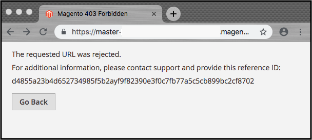
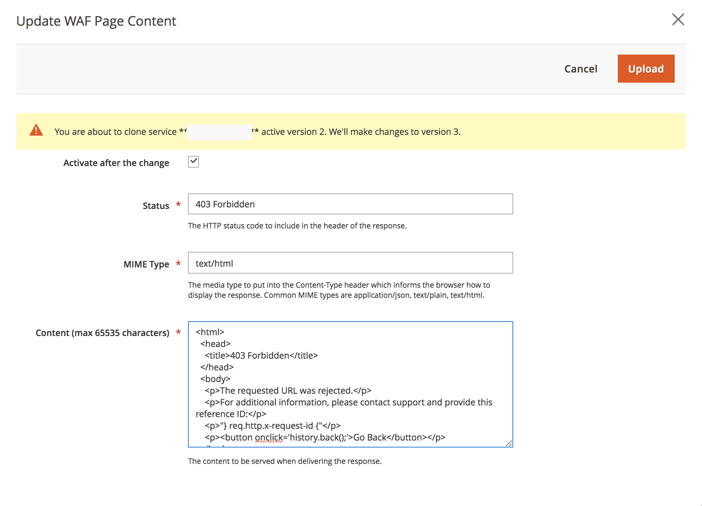

# Anpassa fel- och underhållssidor

När en begäran till Fastly origin misslyckas returnerar Fastly standardsvarssidor med grundläggande formatering och generiska meddelanden som kan vara förvirrande för användarna. Följande standardfelsida returneras till exempel när en begäran till Fastly origin misslyckas på grund av ett 503-fel.


Du kan uppdatera din Adobe Commerce Store-konfiguration så att vissa standardsvarssidor ersätts med sidor som har enklare meddelanden och förbättrad HTML-formatering, vilket visas i följande exempel.


För närvarande kan du anpassa följande snabbsvarssidor för ditt Adobe Commerce i molninfrastrukturprojekt.

- [Serverfel - Internt serverfel, timeout eller fel vid platsunderhåll (felkod 500 eller högre)](#customize-the-503-error-page)
- [WAF blockeringshändelser som inträffar när WAF upptäcker misstänkt trafik på begäran (403 tillåts inte)](#customize-the-waf-error-page)

**Kodningskrav för HTML:**

HTML-koden för den anpassade sidan måste uppfylla följande krav:

- Innehåll kan innehålla upp till 65 535 tecken.
- Ange all infogad CSS i HTML-källan.
- Paketera bilder på HTML-sidan med base64 så att de visas även om Fastly är offline. Se [Data-URI:er på css-tricks-webbplatsen](https://css-tricks.com/data-uris/).

## Anpassa felsidan för 503

Kunderna ser standardsidan med 503 fel i följande fall:

- När en begäran till Fastly origin returnerar en svarsstatus som är större än 500
- När startpunkten är nere, till exempel en timeout, underhållsaktivitet eller hälsoproblem

Du kan anpassa standardsidan genom att anpassa följande HTML-kod så att den innehåller formatmallar som matchar ditt Adobe Commerce Store-tema och ändra titeln och meddelandet efter behov.

```html
<!DOCTYPE html>
<html>
   <head>
      <meta charset="UTF-8">
         <title>503</title>
   </head>
   <body>
      <p>Service unavailable</p>
   </body></html>
```

Kontrollera att den ändrade källan visas korrekt i webbläsaren. Lägg sedan till den anpassade HTML-koden i snabbkonfigurationen.

Så här lägger du till den anpassade svarssidan i snabbkonfigurationen:

{{admin-login-step}}

1. Välj **Lagrar** > **Inställningar** > **Konfiguration** > **Avancerat** > **System**.

1. Expandera **Helsidescache** > **Snabbkonfiguration** > **Anpassade syntetiska sidor** i den högra rutan.

   

1. Välj **Ange HTML**.

1. Kopiera och klistra in källkoden för den anpassade svarssidan i fältet HTML.

   

1. Välj **Överför** högst upp på sidan om du vill överföra den anpassade HTML-källan till snabbservern.

1. Välj **Spara konfiguration** högst upp på sidan om du vill spara den uppdaterade konfigurationsfilen.

1. Uppdatera cachen.

   - Markera länken *Cachehantering* i meddelandet längst upp på sidan.

   - På sidan Cachehantering väljer du **Rensa Magento-cache**.

## Anpassa felsidan för WAF

Kunderna ser följande standardfelsida för WAF när en begäran till Fastly origin misslyckas med ett `403 Forbidden`-fel som orsakas av en [WAF](fastly-waf-service.md) -blockeringshändelse.



I följande kodexempel visas HTML-källan för standardsidan:

```html
<html>
  <head>
    <title>Magento 403 Forbidden</title>
  </head>
  <body>
    <p>The requested URL was rejected.</p>
    <p>For additional information, please contact support and provide this reference ID:</p>
    <p>"} req.http.x-request-id {"</p>
    <p><button onclick='history.back();'>Go Back</button></p>
  </body>
</html>
```

Du kan använda alternativet **Anpassade syntetiska sidor** > **Redigera WAF-sida** på snabbkonfigurationsmenyn för att anpassa standardkoden för Adobe Commerce i molninfrastrukturprojekt. När du redigerar koden ska du behålla följande rad som innehåller referens-ID:t för WAF-blockeringshändelsen:

```html
<p>"} req.http.x-request-id {"</p>
```

>[!NOTE]
>
>Alternativet Redigera WAF är bara tillgängligt om tjänsten Managed Cloud WAF är aktiverad för ditt Adobe Commerce i molninfrastrukturprojekt.

**Så här redigerar du WAF-felsidan**:

1. [Logga in på Admin](../../get-started/onboarding.md#access-your-admin-panel).

1. Välj **Lagrar** > **Inställningar** > **Konfiguration** > **Avancerat** > **System**.

1. Expandera **Helsidescache** > **Snabbkonfiguration** > **Anpassade syntetiska sidor** i den högra rutan.

   

1. Välj **Redigera WAF-sida**.

1. Fyll i fälten för att uppdatera HTML.

   

   - **Status** - Välj `403 Forbidden`-status.
   - **MIME-typ** - typ `text/html`.
   - **Innehåll** - Redigera standardsvaret från HTML för att lägga till anpassad CSS och uppdatera titeln och meddelandet efter behov.

1. Välj **Överför** högst upp på sidan om du vill överföra den anpassade HTML-källan till snabbservern.

1. Välj **Spara konfiguration** högst upp på sidan om du vill spara den uppdaterade konfigurationsfilen.

1. Uppdatera cachen.

   - Markera länken **Cachehantering** i meddelandet längst upp på sidan.

   - På sidan Cachehantering väljer du **Rensa Magento-cache**.

## Visa felrapportnummer

Som standard döljer Fastly alla Adobe Commerce-fel bakom felet *503-tjänsten är inte tillgänglig* . Om du vill visa rapportnumret för felloggen så att du kan hitta och granska felinformationen i loggarna öppnar du webbplatsen utan att använda dessa steg:

1. Hämta IP-adressen till din butik:

   - För Pro Staging- och Production-miljöer:

     ```bash
     nslookup {your_project_id}.ent.magento.cloud
     ```

   - För Pro-integreringsmiljöer och Starter-miljöer:

     ```bash
     nslookup gw.{your_region}.magentosite.cloud
     ```

1. Lägg till programdomänen och IP-adressen till värdfilen på din lokala arbetsstation:

   ```text
   {server_IP} {store_domain}
   ```

1. Rensa webbläsarens cache och cookies (eller växla till inkognito-läge).

1. Öppna butikens webbplats igen för att visa felkoden.

1. Använd felkoden för att hitta informationen i felrapportfilen:

   - [Anslut till den drabbade miljön med SSH](../development/secure-connections.md#connect-to-a-remote-environment)

   - Leta reda på filen `./var/report/{error_number}`.
