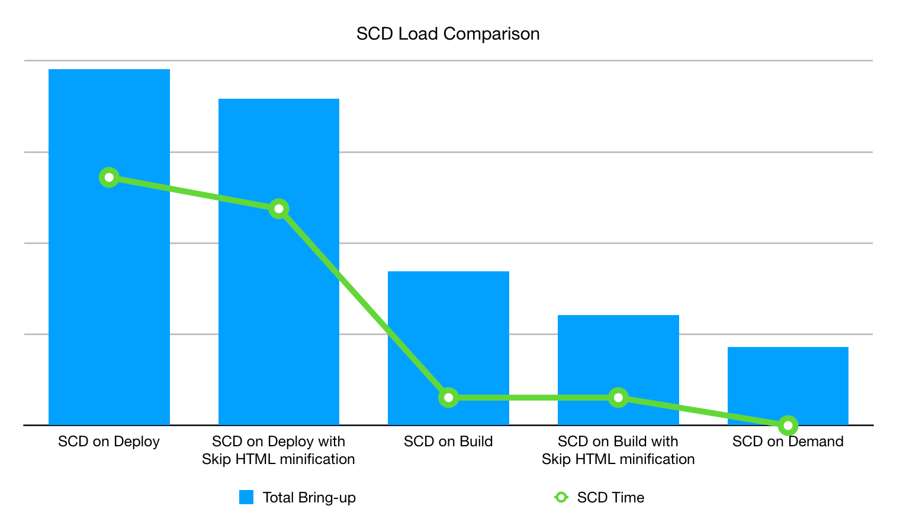

# Strategier för distribution av statiskt innehåll

Distribution av statiskt innehåll (SCD) har stor inverkan på distributionsprocessen för butiken, vilket beror på hur mycket innehåll som ska genereras, till exempel bilder, skript, CSS, videor, teman, språkområden och webbsidor, och när innehållet ska genereras. Standardstrategin genererar till exempel statiskt innehåll under [distributionsfasen](process.md#deploy-phase-deploy-phase) när platsen är i underhållsläge, men den här distributionsstrategin tar tid att skriva innehållet direkt till den monterade `pub/static`-katalogen. Du har flera alternativ eller strategier som hjälper dig att förbättra driftsättningstiden beroende på dina behov.

## Optimera JavaScript- och HTML-material

Ni kan använda paketering och miniatyrbilder för att skapa optimerat JavaScript- och HTML-innehåll under distributionen av statiskt innehåll.

### Minimera innehåll

Du kan förbättra SCD-inläsningstiden under distributionsprocessen om du hoppar över kopieringen av statiska vyfiler i katalogen `var/view_preprocessed` och genererar _minified_ HTML när det efterfrågas. Du kan aktivera detta genom att ange den globala miljövariabeln [SKIP_HTML_MINIFICATION](../environment/variables-global.md#skiphtmlminification) till `true` i filen `.magento.env.yaml`.

>[!NOTE]
>
>Från och med paketversionen `ece-tools` 2002.0.13 är standardvärdet för variabeln SKIP_HTML_MINIFICATION inställt på `true`.

Du kan spara **mer** distributionstid och diskutrymme genom att minska antalet onödiga temafiler. Du kan till exempel distribuera `magento/backend`-temat på engelska och ett anpassat tema på andra språk. Du kan konfigurera de här temainställningarna med miljövariabeln [SCD_MATRIX](../environment/variables-deploy.md#scdmatrix) .

## Välja en distributionsstrategi

Distributionsstrategierna skiljer sig åt beroende på om du väljer att generera statiskt innehåll under fasen _build_, fasen _deploy_ eller fasen _on demand_. Som framgår av följande diagram är det minst optimala alternativet att generera statiskt innehåll under distributionsfasen. Även med minifierad HTML måste varje innehållsfil kopieras till den monterade katalogen `~/pub/static`, vilket kan ta lång tid. Att generera statiskt innehåll on demand verkar vara det optimala valet. Men om innehållsfilen inte finns i cachen genereras den när den begärs, vilket ökar användarens inläsningstid. Därför är det mest optimala att generera statiskt innehåll under byggfasen.



### Ställa in SCD vid skapande

Att generera statiskt innehåll under byggfasen med minifierad HTML är den optimala konfigurationen för [**noll-nedtid**-distributioner](reduce-downtime.md), som också kallas **idealiskt läge**. I stället för att kopiera filer till en monterad enhet skapas en länk från katalogen `./init/pub/static`.

För att generera statiskt innehåll måste du ha tillgång till teman och språkområden. Adobe Commerce lagrar teman i filsystemet, som är tillgängligt under byggfasen, men i Adobe Commerce lagras språkinställningarna i databasen. Databasen är _inte_ tillgänglig under byggfasen. För att kunna generera det statiska innehållet under byggfasen måste du använda kommandot `config:dump` i paketet `ece-tools` för att flytta språkområden till filsystemet. Det läser språkinställningarna och sparar dem i filen `app/etc/config.php`.

>[!NOTE]
>När du har kört kommandot `config:dump` i paketet `ece-tools` låses (nedtonas) de konfigurationer som dumpas i filen `config.php` [ på Admin Dashboard](https://experienceleague.adobe.com/sv/docs/commerce-knowledge-base/kb/troubleshooting/miscellaneous/locked-fields-in-magento-admin). Det enda sättet att uppdatera dessa konfigurationer i Admin är att ta bort dem från filen lokalt och distribuera om projektet.
>&#x200B;>Varje gång du lägger till en ny butiks-/butiksgrupp/webbplats i din instans måste du dessutom köra kommandot `config:dump` för att vara säker på att databasen är synkroniserad. Du kan också välja [vilka konfigurationer som ska dumpas](https://experienceleague.adobe.com/sv/docs/commerce-operations/configuration-guide/cli/configuration-management/export-configuration?lang=en) i `config.php`-filen.
>&#x200B;>Om du tar bort konfigurationen av grupp/webbplats för butik/butik från filen `config.php` eftersom fälten är nedtonade men inte utför det här steget, tas de nya entiteterna som inte har dumpats bort från databasen vid nästa distribution.

**Så här konfigurerar du projektet för att generera SCD vid bygge**:

1. Byt till din projektkatalog på din lokala arbetsstation.
1. Använd SSH för att logga in i fjärrmiljön.

   ```bash
   magento-cloud ssh
   ```

1. Flytta språkinställningar till filsystemet och uppdatera sedan [`config.php`-filen ](../development/commerce-version.md#create-a-configphp-file).

1. Konfigurationsfilen `.magento.env.yaml` ska innehålla följande värden:

   - [SKIP_HTML_MINIFICATION](../environment/variables-global.md#skip_html_minification) är `true`
   - [SKIP_SCD](../environment/variables-build.md#skip_scd) på byggscenen är `false`
   - [SCD_STRATEGY](../environment/variables-build.md#scd_strategy) är `compact`

1. Verifiera konfigurationen för [funktionen efter distribuering](../application/hooks-property.md) i filen `.magento.app.yaml`.

1. Verifiera dina inställningar genom att köra den [smarta guiden för det idealiska läget](smart-wizards.md).

   ```bash
   php ./vendor/bin/ece-tools wizard:ideal-state
   ```

### Ställa in SCD på begäran

Att generera SCD on demand är optimalt för ett utvecklingsarbetsflöde i integreringsmiljön. Det minskar driftsättningstiden så att du snabbt kan granska implementeringarna och köra integreringstester. Aktivera miljövariabeln [SCD_ON_DEMAND](../environment/variables-global.md#scdondemand) i den globala scenen i filen `.magento.env.yaml`. Variabeln SCD_ON_DEMAND åsidosätter alla andra konfigurationer som är relaterade till SCD och tar bort befintligt innehåll från katalogen `~/pub/static`.

När du använder SCD on demand-strategin är det bra att läsa in cachen i förväg med sidor som du förväntar dig, till exempel hemsidan. Lägg till din lista över förväntade sidor i miljövariabeln [WARM_UP_PAGES](../environment/variables-post-deploy.md#warmuppages) i post-deploy-fasen av filen `.magento.env.yaml`.

>[!WARNING]
>
>Använd inte SCD on demand-strategin i produktionsmiljön.

### Hoppar över SCD

Ibland kan du välja att inte generera statiskt innehåll helt. Du kan ställa in miljövariabeln [SKIP_SCD](../environment/variables-build.md#skipscd) på den globala scenen så att andra konfigurationer som är relaterade till SCD ignoreras. Detta påverkar inte befintligt innehåll i katalogen `~/pub/static`.
