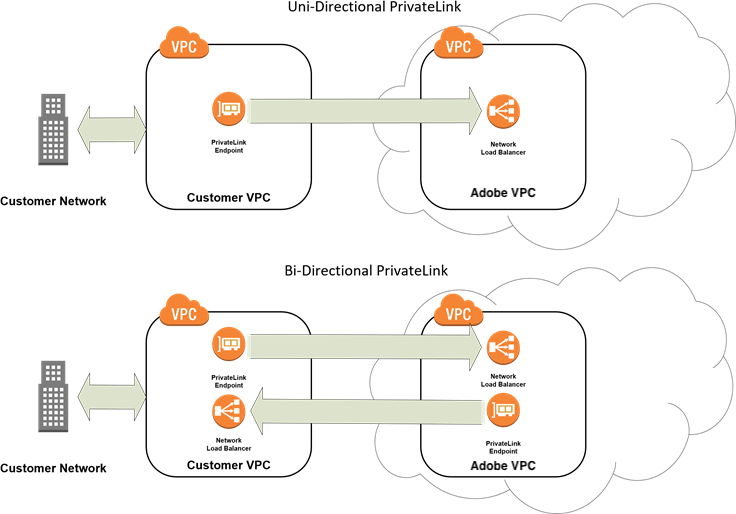

# PrivateLink-tjänst

Adobe Commerce i molninfrastrukturen stöder integrering med tjänsten [AWS PrivateLink](https://aws.amazon.com/privatelink/) eller [Azure Private Link](https://learn.microsoft.com/en-us/azure/private-link/) . Du kan använda PrivateLink för att upprätta säker, privat kommunikation mellan Adobe Commerce i molninfrastrukturmiljöer med tjänster och program som finns på externa system. Både Adobe Commerce-programmet och de externa systemen måste vara tillgängliga via VPC-slutpunkter (Virtual Private Cloud) som konfigurerats på samma molnplattform (AWS eller Azure) inom samma molnregion.

>[!TIP]
>
>PrivateLink används bäst för att skydda anslutningar för icke-HTTP(S)-integreringar, som databaser eller filöverföringar. Om du tänker integrera ditt program med Adobe Commerce API:er kan du läsa om hur du skapar ett [Adobe API Mesh](https://developer.adobe.com/graphql-mesh-gateway/gateway/create-mesh/) i _API Mesh för Adobe Developer App Builder_.

## Funktioner och support

Integreringen av PrivateLink-tjänsten för Adobe Commerce i molninfrastrukturprojekt innehåller följande funktioner och support:

- En säker anslutning mellan ett kundens virtuella privata moln (VPC) och Adobe VPC på samma molnplattform (AWS eller Azure) inom samma molnregion.
- Stöd för enkelriktad eller dubbelriktad kommunikation mellan slutpunktstjänster som finns på Adobe och våra VPC:er.
- Tjänstaktivering:

   - Öppna nödvändiga portar i Adobe Commerce i molninfrastruktursmiljö
   - Upprätta den första anslutningen mellan kunden och Adobe VPC:er
   - Felsöka anslutningsproblem under aktivering

## Begränsningar

- Stöd för PrivateLink finns endast i Pro Production- och Staging-miljöer. Det är inte tillgängligt i lokala miljöer, integreringsmiljöer eller i Starter-projekt.
- Du kan inte upprätta SSH-anslutningar med PrivateLink. Se [Aktivera SSH-nycklar](secure-connections.md).
- Adobe Commerce support omfattar inte felsökning av AWS PrivateLink-problem utöver den initiala aktiveringen.
- Kunderna ansvarar för kostnaderna för att hantera sina egna VPC.
- **Stöd för HTTPS-protokoll (port 443) per plattform:**
   - **Azure Private Link**: Du kan inte använda HTTPS-protokollet (port 443) för att ansluta till Adobe Commerce i molninfrastrukturen på grund av [Insvepning med snabbt ursprung](https://experienceleague.adobe.com/docs/commerce-knowledge-base/kb/faq/fastly-origin-cloaking-enablement-faq.html?lang=sv-SE).
   - **AWS PrivateLink**: HTTPS-protokollanslutningar (port 443) stöds.
- PrivateDNS är inte tillgängligt.

## Anslutningstyper för PrivateLink

Det finns två typer av PrivateLink-anslutningar tillgängliga - vilket visas i följande nätverksdiagram - för att upprätta säker kommunikation mellan din butik och externa system som ligger utanför molnmiljön.



Välj en av de PrivateLink-anslutningstyper som passar bäst för din Adobe Commerce i molninfrastrukturmiljöer:

- **Unidirectional PrivateLink**-Välj den här konfigurationen om du vill hämta data säkert från ett Adobe Commerce-infrastrukturarkiv i molnet.
- **Dubbelriktad PrivateLink**-Välj den här konfigurationen för att upprätta säkra anslutningar till och från system utanför Adobe Commerce i molninfrastrukturmiljön. Dubbelriktat alternativ kräver två anslutningar:

   - En anslutning mellan kunden VPC och Adobe VPC
   - En anslutning mellan Adobe VPC och VPC

>[!TIP]
>
>Kontakta nätverksadministratören eller molnplattformsleverantören för att få hjälp med att välja anslutningstypen PrivateLink eller hjälp med konfiguration och administration av VPC. Se dokumentationen för PrivateLink för molnplattformen: [AWS PrivateLink](https://aws.amazon.com/privatelink/) eller [Azure Private Link](https://learn.microsoft.com/en-us/azure/private-link/).

## Begär aktivering av PrivateLink

>[!WARNING]
>
>Det kan ta upp till _fem_ arbetsdagar att aktivera PrivateLink. Att tillhandahålla ofullständig eller felaktig information kan fördröja processen.

### Förutsättningar

 Ett molnkonto (AWS eller Azure) i samma region som Adobe Commerce på molninfrastrukturinstansen.

 En VPC i kundmiljön som är värd för tjänsterna som ska anslutas via PrivateLink. Läs AWS- eller Azure-dokumentationen om du behöver hjälp med VPC-installationen eller kontakta nätverksadministratören.

 För dubbelriktade PrivateLink-anslutningar måste du skapa slutpunktstjänstkonfigurationen för programmet eller tjänsten och skapa en slutpunkt i VPC-miljön innan du begär PrivateLink-aktivering. Se [Konfigurera för dubbelriktade PrivateLink-anslutningar](#set-up-for-bidirectional-privatelink-connections).

Samla in följande data som krävs för PrivateLink-aktivering:

- **Kundmolnkontonummer** (AWS eller Azure) - måste finnas i samma region som Adobe Commerce på molninfrastrukturinstansen
- **Molnregion** - Ange den molnregion där kontot finns för verifieringsändamål
- **Tjänster och kommunikationsportar** - Adobe måste öppna portar för att kunna aktivera tjänstkommunikation mellan VPC:er, till exempel SQL-port 3306, SFTP-port 2222
- **Projekt-ID** - Ange Adobe Commerce för projekt-ID:t för molninfrastrukturen. Du kan hämta projekt-ID och annan projektinformation med följande [Cloud CLI](../dev-tools/cloud-cli-overview.md)-kommando: `magento-cloud project:info`
- **Anslutningstyp** - Ange enkelriktad eller dubbelriktad för anslutningstyp
- **Endpoint service** - För dubbelriktade PrivateLink-anslutningar anger du DNS-URL:en för VPC-slutpunktstjänsten som Adobe måste ansluta till, till exempel: `com.amazonaws.vpce.<cloud-region>.vpce-svc-<service-id>`
- **Åtkomst till slutpunktstjänsten har beviljats** - Om du vill ansluta till en extern tjänst måste du ge slutpunktstjänsten åtkomst till följande AWS-kontokonto: `arn:aws:iam::402592597372:root`

  >[!WARNING]
  >
  >Om åtkomst till slutpunktstjänsten inte tillhandahålls läggs **inte**-dubbelriktad PrivateLink-anslutning till tjänsten i din VPC till, vilket fördröjer konfigurationen.

#### Ytterligare krav som är specifika för aktivering av Azure Private Link

- Ange kluster-ID; med SSH loggar du in på fjärrkontrollen och använder kommandot: `cat /etc/platform_cluster`
- För att kunna ansluta en extern tjänst till ditt Adobe Commerce Pro-kluster behöver du:

   - En lista över portar i ditt Pro-kluster som ska visas för den nya externa privata slutpunkten
   - En lista över Azure-prenumerations-ID:n för privata slutpunktsanslutningar

- Om du vill ansluta ditt Adobe Commerce Pro-kluster till en extern tjänst behöver du:

   - En lista över resurs-ID:n för måltjänsterna. Tjänst-ID för extern privat länk ser ut ungefär så här:

  ```text
  /subscriptions/{subscriptionId}/resourceGroups/{resourceGroupName}/providers/Microsoft.Network/privateLinkServices/{svcNameID}
  ```

### Arbetsflöde för aktivering

I följande arbetsflöde beskrivs aktiveringsprocessen för PrivateLink-integrering med Adobe Commerce i molninfrastrukturen.

1. **Kunden** skickar en supportbiljett med en begäran om PrivateLink-aktivering med ämnesraden `PrivateLink support for <company>`. Inkludera de [data som krävs för aktivering](#prerequisites) i biljetten. Adobe använder supportbiljetten för att koordinera kommunikationen under aktiveringsprocessen.

1. **Adobe** ger åtkomst till slutpunktstjänsten i Adobe VPC.

   - Uppdatera slutpunktstjänstkonfigurationen för Adobe för att acceptera begäranden som initierats från kundens AWS- eller Azure-konto.
   - Uppdatera supportbiljetten för att ange tjänstnamnet för den Adobe VPC-slutpunkt som ska anslutas till, till exempel `com.amazonaws.vpce.<cloud-region>.vpce-svc-<service-id>`.

1. **Kunden** lägger till Adobe-slutpunktstjänsten i sitt molnkonto (AWS eller Azure), vilket utlöser en anslutningsbegäran till Adobe. Mer information finns i dokumentationen för molnplattformen:

   - Information om AWS finns i [Acceptera och ignorera anslutningsbegäranden för gränssnittets slutpunkt].
   - För Azure, se [Hantera anslutningsbegäranden].

1. **Adobe** godkänner anslutningsbegäran.

1. **Kunden** [verifierar anslutningen](#test-vpc-endpoint-service-connection) mellan VPC och Adobe VPC när anslutningsbegäran har godkänts.Kunden verifierar anslutningen.

1. Ytterligare steg för att aktivera dubbelriktade anslutningar:

   - **Adobe** förser Adobe-kontots huvudnamn (rotanvändare för AWS- eller Azure-konton) och begär åtkomst till kundens VPC slutpunktstjänst.
   - **Kunden** ger Adobe åtkomst till slutpunktstjänsten i VPC. Detta förutsätter att Adobe-kontots huvudnamn har åtkomst till `arn:aws:iam::402592597372:root`, vilket tidigare har beskrivits i den **slutpunktstjänståtkomst som beviljats**.

      - Uppdatera kundens slutpunktstjänstkonfiguration för att acceptera begäranden som initierats från Adobe-kontot. Mer information finns i dokumentationen för molnplattformen:

         - Mer information om AWS finns i [Lägga till och ta bort behörigheter för slutpunktstjänsten].
         - För Azure, se [Hantera en privat slutpunktsanslutning]

      - Ge Adobe slutpunktstjänstens namn för kunden VPC.

   - **Adobe** lägger till kundslutpunktstjänsten i Adobe-plattformskontot (AWS eller Azure), som utlöser en anslutningsbegäran till kund-VPC.
   - **Kunden** godkänner anslutningsbegäran från Adobe för att slutföra konfigurationen.
   - **Kunden** [verifierar anslutningen](#test-vpc-endpoint-service-connection) från Adobe VPC.

## Testa VPC slutpunktstjänstanslutning

Du kan använda Telnet-programmet för att testa anslutningen till VPC slutpunktstjänst.

**Så här testar du anslutningen till VPC slutpunktstjänst**:

1. I projektets rotkatalog **checkar du ut** från mellanlagrings- eller produktionsmiljön som konfigurerats för åtkomst till PrivateLink-slutpunktstjänsten.

   ```bash
   magento-cloud environment:checkout <environment-id>
   ```

1. Kör följande CURL-kommando:

   ```bash
   curl -v telnet://<endpoint-service-dns-url>:<port>/
   ```

   Exempel:

   ```
   $ curl -v telnet://vpce-007ffnb9qkcnjgult-yfhmywqh.vpce-svc-083cqvm2ta3rxqat5v.us-east-1.vpce.amazonaws.com:80 -vvv
   ```

   Exempel på lyckat svar:

   ```
   * Rebuilt URL to: telnet://vpce-007ffnb9qkcnjgult-yfhmywqh.vpce-svc-083cqvm2ta3rxqat5v.us-east-1.vpce. amazonaws.com:80
   * Connected to vpce-0088d56482571241d-yfhmywqh.vpce-svc-083cqvm2ta3rxqat5v.us-east-1.vpce. amazonaws.com (191.210.82.246) port 80 (#0)
   ```

   Samplingssvaret misslyckades:

   ```
   Failed to connect to vpce-007ffnb9qkcnjgult-yfhmywqh.vpce-svc-083cqvm2ta3rxqat5v.ap-southeast-1.vpce.amazonaws.com port 80: Connection timed out
   * Closing connection 0
   ```

1. Kontrollera att tjänsten lyssnar på VM.

   ```bash
   netstat -na | grep <port>
   ```

1. Kontrollera paketflödet.

   ```bash
   tcpdump -i <ethernet-interface> -tt -nn port <destination-port> and host <source-host>
   ```

   Kontrollera följande interna inställningar för att säkerställa att konfigurationen är giltig:

   - Inställningar för slutpunkts- och slutpunktstjänster
   - NLB-inställningar (Network Load Balancer)
   - Målgrupperna i NLB och verifiera att de är felfria
   - URL för netcat/curl-slutpunkt från varje virtuell dator (visas ovan)

   I följande artiklar finns hjälp med att felsöka anslutningsproblem:

   - [AWS: Felsökning av anslutningar till slutpunktstjänster]
   - [Amazon: Felsökning av anslutningsproblem med Azure Private Link]

   Om du inte kan åtgärda felen kan du uppdatera Adobe Commerce supportanmälan och be om hjälp med att upprätta anslutningen.

## Ändra konfiguration för PrivateLink

[Skicka en Adobe Commerce-supportanmälan](https://experienceleague.adobe.com/docs/commerce-knowledge-base/kb/help-center-guide/magento-help-center-user-guide.html?lang=sv-SE#submit-ticket) om du vill ändra en befintlig PrivateLink-konfiguration. Du kan till exempel begära ändringar enligt följande:

- Ta bort PrivateLink-anslutningen från Adobe Commerce i molninfrastrukturen Pro Production eller Staging-miljön.
- Ändra kundens Cloud-plattformskontonummer för åtkomst till Adobe slutpunktstjänst.
- Lägg till eller ta bort PrivateLink-anslutningar från Adobe VPC till andra slutpunktstjänster som är tillgängliga i VPC-kundens miljö.

## Konfigurera för dubbelriktade PrivateLink-anslutningar

Kunden VPC måste ha tillgång till följande resurser för att stödja dubbelriktade PrivateLink-anslutningar:

- En NLB (Network Load Balancer)
- En slutpunktstjänstkonfiguration som ger åtkomst till ett program eller en tjänst från kunden VPC
- En [gränssnittsslutpunkt] (AWS) eller [privat slutpunkt] (Azure) som gör att Adobe kan ansluta till slutpunktstjänster på din VPC

Om dessa resurser inte är tillgängliga i kundens VPC måste du logga in på ditt molnplattformskonto för att lägga till konfigurationen.

- Amazon VPC-konsol- `https://console.aws.amazon.com/vpc/`
- Azure-portal - `https://portal.azure.com`

Se dokumentationen för molnplattformen för konfigureringsinstruktioner för PrivateLink:

- **AWS PrivateLink-dokumentation**
   - [Skapa en utjämning för nätverksbelastning]
   - [Skapa en tjänstkonfiguration för slutpunkt]
   - [Skapa en gränssnittsslutpunkt]
   - [Livscykel för gränssnittets slutpunkt]

- **Azure PrivateLink-dokumentation**
   - [Skapa en belastningsutjämnare]
   - [Azure Private Link-arbetsflöde]

<!--Link definitions-->

[Acceptera och avvisa anslutningsbegäranden för gränssnittets slutpunkt]: https://docs.aws.amazon.com/vpc/latest/userguide/accept-reject-endpoint-requests.html
[Lägga till och ta bort behörigheter för slutpunktstjänsten]: https://docs.aws.amazon.com/vpc/latest/userguide/add-endpoint-service-permissions.html
[Amazon: Felsökning av anslutningsproblem med Azure Private Link]: https://docs.microsoft.com/en-us/azure/private-link/troubleshoot-private-link-connectivity
[AWS: Felsöka anslutningar till slutpunktstjänster]: https://aws.amazon.com/premiumsupport/knowledge-center/connect-endpoint-service-vpc/
[Arbetsflöde för Azure Private Link]: https://docs.microsoft.com/en-us/azure/private-link/private-link-service-overview#workflow
[Skapa en belastningsutjämnare]: https://docs.microsoft.com/en-us/azure/load-balancer/quickstart-load-balancer-standard-public-portal
[Skapa en utjämning för nätverksbelastning]: https://docs.aws.amazon.com/elasticloadbalancing/latest/network/create-network-load-balancer.html
[Skapa en konfiguration för slutpunktstjänsten]: https://docs.aws.amazon.com/vpc/latest/userguide/create-endpoint-service.html
[Skapa en gränssnittsslutpunkt]: https://docs.aws.amazon.com/vpc/latest/userguide/vpce-interface.html#create-interface-endpoint
[interface endpoint lifecycle]: https://docs.aws.amazon.com/vpc/latest/userguide/vpce-interface.html#vpce-interface-lifecycle
[gränssnittsslutpunkt]: https://docs.aws.amazon.com/vpc/latest/userguide/vpce-interface.html
[Hantera en privat slutpunktsanslutning]: https://docs.microsoft.com/en-us/azure/private-link/manage-private-endpoint
[Hantera anslutningsbegäranden]: https://docs.microsoft.com/en-us/azure/private-link/private-link-service-overview#manage-your-connection-requests
[privat slutpunkt]: https://docs.microsoft.com/en-us/azure/private-link/private-endpoint-overview
