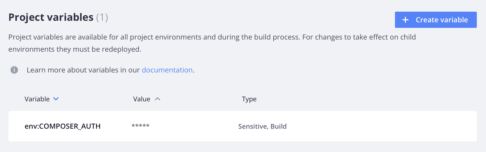

# Variabelnivåer

Projektvariabler gäller för alla miljöer i projektet. Miljövariabler gäller för en viss miljö eller gren. En miljö _ärver_ variabeldefinitioner från den överordnade miljön.

Du kan åsidosätta ett ärvt värde genom att definiera variabeln specifikt för miljön. Om du till exempel vill ange variabler för utveckling definierar du variabelvärdena i filen `.magento.env.yaml` i integreringsmiljön. Alla miljöer som härstammar från integreringsmiljön ärver dessa värden. Mer information om hur du konfigurerar miljön med hjälp av filen `.magento.env.yaml` finns i [Distributionskonfiguration](configure-env-yaml.md).

>[!BEGINTABS]

>[!TAB CLI]

**Så här anger du variabler med Cloud CLI**:

- **Projektspecifika variabler** - Om du vill ange samma värde för _alla_ -miljöer i ditt projekt. Dessa variabler är tillgängliga vid bygge och körning i alla miljöer.

  ```bash
  magento-cloud variable:create --level project --name <variable-name> --value <variable-value>
  ```

- **Miljöspecifika variabler** - Om du vill ange ett unikt värde för en _specifik_-miljö. Dessa variabler är tillgängliga vid körning och ärvs av underordnade miljöer. Ange miljön i kommandot med alternativet `-e`.

  ```bash
  magento-cloud variable:create --level environment --name <variable-name> --value <variable-value>
  ```

När du har angett projektspecifika variabler måste du distribuera om fjärrmiljön manuellt för att ändringen ska börja gälla. Tryck på de nya implementeringarna för att utlösa en omdistribution.

>[!TAB Konsol]

**Så här anger du variabler med[!DNL Cloud Console]**:

1. Klicka på konfigurationsikonen till höger om projektnavigeringen i _[!DNL Cloud Console]_.

   {width="36"}

1. Om du vill ange en variabel på projektnivå går du till _Projektinställningar_ och klickar på **Variabler**.

   

1. Om du vill ange en variabel på miljönivå väljer du en miljö i listan _Miljö_ och klickar på fliken **[!UICONTROL Variables]** .

   

1. Klicka på **[!UICONTROL Create variable]**.

1. Ange ett namn och värde för variabeln. Välj bland alternativen:

   - Tillgängligt under körning
   - Tillgängligt under byggtid
   - JSON-värde
   - Känslig variabel (dolt värde i konsolen och CLI-svar)
   - Gör ärftlig (underordnade miljöer kan ärva miljönivåvariabler)

1. Klicka på **[!UICONTROL Create variable]**.

>[!CAUTION]
>
>Miljön omdistribueras automatiskt när miljöspecifika variabler anges i [!DNL Cloud Console].

>[!ENDTABS]

## Synlighet

Du kan begränsa synligheten för en variabel under generering eller körning med kommandot `--visible-<build|runtime>`. Det finns även alternativ för att ange arv och känslighet.

Använd följande alternativ för att förhindra att en variabel visas eller ärvs:

- `--inheritable false` - inaktiverar arv för underordnade miljöer. Detta är användbart för att ange värden som bara är för produktion i grenen `master` och för att tillåta att alla andra miljöer använder en projektnivåvariabel med samma namn.
- `--sensitive true` - markerar variabeln som _oläsbar_ i [!DNL Cloud Console]. Du kan inte visa variabeln i användargränssnittet, men du kan visa variabeln från programbehållaren, precis som andra variabler.

I följande exempel visas ett specifikt fall som förhindrar att en variabel visas eller ärvs. Du kan bara ange dessa alternativ i CLI. Det här fallet gäller inte alla tillgängliga miljövariabler.

```bash
magento-cloud variable:create --name <variable-name> --value <variable-value> --inheritable false --sensitive true
```

## Verifiera variabelnivåer och värden

Du kan visa en lista med befintliga variabler med hjälp av CLI i molnet.

```bash
magento-cloud variables
```

```
Variables on the project Project-Name (<project-id>), environment <environment-name>:
+----------------------------+-------------+-------------------------------------------+
| Name                       | Level       | Value                                     |
+----------------------------+-------------+-------------------------------------------+
| env:COMPOSER_AUTH          | project     | {                                         |
|                            |             |    "http-basic": {                        |
|                            |             |       "repo.magento.com": {               |
|                            |             |       "username":                         |
|                            |             | "<public-key>",                           |
|                            |             |       "password":                         |
|                            |             | "<private-key>"                           |
|                            |             |     }                                     |
|                            |             |   }                                       |
|                            |             | }                                         |
| ADMIN_EMAIL                | project     | admin@123.com                             |
| ADMIN_EMAIL                | environment | admin@123.com                             |
| ADMIN_PASSWORD             | environment | password                                  |
| ADMIN_URL                  | environment | admin123                                  |
| ADMIN_USERNAME             | environment | admin                                     |
| php:newrelic.license       | environment | xxxx71fb030366182117f955a22e4baf8exxxxxx  |
+----------------------------+-------------+-------------------------------------------+
```
