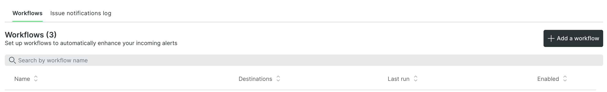

# New Relic-övervakning

New Relic ansluter och övervakar din infrastruktur och ditt [!DNL Commerce]-program med PHP-agenter. När en molnmiljö har anslutit till New Relic kan du logga in på ditt New Relic-konto för att granska de data som samlas in av agenten.

På sidan _APM &amp; Services_ väljer du **Sammanfattning** för att visa transaktionsinformation om programmet. I den här vyn kan du identifiera potentiella fel och kontrollera den övergripande statusen för dina program och tjänster.

I den här vyn kan du spåra transaktioner som stöter på långsamma svar eller flaskhalsar, applikationens genomströmning, webbfel med mera.

Granska spårade data:

- **Den mest tidskrävande** - Bestäm tidsåtgången genom att spåra begäranden parallellt. Du kan till exempel ha den högsta transaktionstiden i produkt- och kategorivyer. Om en kundkontosida plötsligt rankas som hög i tidskonsumtion kan programmet påverkas av att användaren ringer eller drar frågor.

- **Högsta genomströmning** - Identifiera sidor som träffar mest baserat på storleken och frekvensen på de byte som skickas.

Alla insamlade data visar hur lång tid som har ägnats åt åtgärder som överför data, frågor eller _Redis_ -data. Om det uppstår problem i en fråga tillhandahåller New Relic information för att spåra och besvara dessa problem.

>[!TIP]
>
>Mer information om hur du använder dessa data för att felsöka programprestandaproblem finns i [Felsöka prestanda med New Relic](https://experienceleague.adobe.com/docs/commerce-knowledge-base/kb/troubleshooting/miscellaneous/troubleshoot-performance-using-new-relic-on-magento-commerce.html?lang=sv-SE) i _Adobe Commerce Help Center_.

## Övervaka prestanda med hanterade aviseringar

Adobe tillhandahåller aviseringsprincipen _Hanterade aviseringar för Adobe Commerce_ för att spåra prestandamått. Principen innehåller en samling varningar som anger tröskelvärden och utlöser varningar och kritiska meddelanden när infrastruktur- eller programproblem påverkar webbplatsens prestanda. Policyn håller reda på följande mått för produktionsmiljöer:

| Mått | Datainsamling | Tillgänglighet |
|:-------------------|:----------------|:----------------|
| [!DNL Apdex] poäng | APM | Pro och Starter |
| Användning i CPU | NRI | Pro |
| Diskutrymme | NRI | Pro |
| Felfrekvens | APM | Pro och Starter |
| Minnesanvändning | NRI | Pro |
| MariaDB-frågeinläsning | NRI | Pro |
| Redis-minne | NRI | Pro |

När webbplatsinfrastruktur eller programförhållanden utlöser ett tröskelvärde för avisering skickar New Relic varningsmeddelanden så att du kan åtgärda problemet proaktivt. Se [Hanterade aviseringar för Adobe Commerce](https://experienceleague.adobe.com/docs/commerce-knowledge-base/kb/support-tools/managed-alerts/managed-alerts-for-magento-commerce.html?lang=sv-SE) i _Adobe Commerce Help Center_ för information om tröskelvärden för aviseringar och felsökningssteg för att lösa de problem som utlöste aviseringen.

>[!TIP]
>
>För Pro Staging- och integreringsmiljöer samt Starter-miljöer använder du [Hälsomeddelanden](../integrations/health-notifications.md) för att övervaka diskutrymmet.

>[!PREREQUISITES]
>
>- **New Relic-autentiseringsuppgifter** - Autentiseringsuppgifter för att logga in på New Relic-kontot för ditt molnprojekt
>- **Aktiv integrering med New Relic** - Kontrollera att molnmiljön är ansluten till New Relic
>- **Arbetsflödesmeddelande** - Konfigurera minst ett [arbetsflöde](#set-up-a-workflow-for-notifications) för att ta emot varningsmeddelanden

**Så här granskar du hanterade aviseringar för Adobe Commerce-principen**:

1. Logga in på ditt [New Relic-konto](https://login.newrelic.com/login).

1. Leta reda på principen _Managed Alerts för Adobe Commerce_:

   - Klicka på **[!UICONTROL Alerts & AI]** på navigeringsmenyn i Utforskaren.

   - Klicka på **[!UICONTROL Alert Conditions & Policies]** under _Identifiera_.

   - Kontrollera att ditt konto är markerat högst upp i vyn _Villkor och principer för varning_.

   - Välj **Hanterade aviseringar för Adobe Commerce**-principen i listan _Princip_.

     

     >[!NOTE]
     >
     >Om principen _Managed Alerts for Adobe Commerce_ inte är tillgänglig kan du läsa [Managed Alerts for Adobe Commerce](https://experienceleague.adobe.com/docs/commerce-knowledge-base/kb/support-tools/managed-alerts/managed-alerts-for-magento-commerce.html?lang=sv-SE) i _Adobe Commerce Help Center_.

1. Klicka på fliken **[!UICONTROL Alert conditions]** om du vill granska de varningsvillkor som definierats i profilen.

## Skapa aviseringsprinciper

Ändra inte några aviseringar som ingår i policyn för hanterade aviseringar för Adobe Commerce. Adobe uppdaterar och förbättrar aviseringsvillkoren i den här principen över tid, vilket skriver över eventuella anpassningar som du lägger till i principen.

I stället för att ändra en befintlig avisering kan du skapa en aviseringsprincip. Kopiera sedan varningsvillkoren till den nya profilen.

>[!TIP]
>
>Se [Introduktion till aviseringar](https://docs.newrelic.com/docs/alerts/overview/) i _New Relic_ -dokumentationen för mer detaljerad information om aviseringar, aviseringsprinciper och arbetsflöden.

## Konfigurera ett arbetsflöde för meddelanden

Du kan nu konfigurera ett _arbetsflöde_ (tidigare kallat en meddelandekanal) för att få meddelanden om webbplatsens prestanda baserat på filtrerade data, till exempel en aviseringsprincip. Meddelanden om prestandaproblem skickas till alla arbetsflöden som är kopplade till en aviseringsprincip när villkoren i programmet eller infrastrukturen utlöser en avisering. Du får också meddelanden när en utgåva har bekräftats och stängts.

New Relic innehåller mallar för konfigurering av olika typer av arbetsflödesmeddelanden, bland annat e-post, Slack, PagerDuty, webhooks med flera.

**Så här konfigurerar du ett arbetsflöde**:

1. Logga in på ditt [New Relic-konto](https://login.newrelic.com/login).

1. Skapa ett arbetsflöde.

   - Klicka på **[!UICONTROL Alerts & AI]** på navigeringsmenyn i Utforskaren.

   - Klicka på **[!UICONTROL Workflows]** i den vänstra navigeringen under _Förbättra och meddela_.

   - Klicka på **[!UICONTROL Add a workflow]** till höger.

     

   - Ange ett namn för arbetsflödet på sidan _Konfigurera ditt arbetsflöde_.

   - I avsnittet _Filtrera data_ väljer du **[!UICONTROL Managed Alerts for Adobe Commerce]** i listrutan **[!UICONTROL Policy]**.

   - Markera en kanal i avsnittet _Meddela_ och följ instruktionerna.

   - Klicka på **[!UICONTROL Test workflow]** för att verifiera konfigurationen.

1. Klicka på **[!UICONTROL Activate workflow]**.

Läs New Relic-dokumentationen om [arbetsflöden](https://docs.newrelic.com/docs/alerts-applied-intelligence/applied-intelligence/incident-workflows/incident-workflows/).

>[!WARNING]
>
>Aviseringarna i principen Managed Alerts för Adobe Commerce har standardarbetsflöden konfigurerade för att meddela Adobe-team som stöder Adobe Commerce om molninfrastrukturskunder. Ändra inte konfigurationen för dessa standardkanaler och ta inte bort eventuella varningsprofiler som tilldelats dem.
