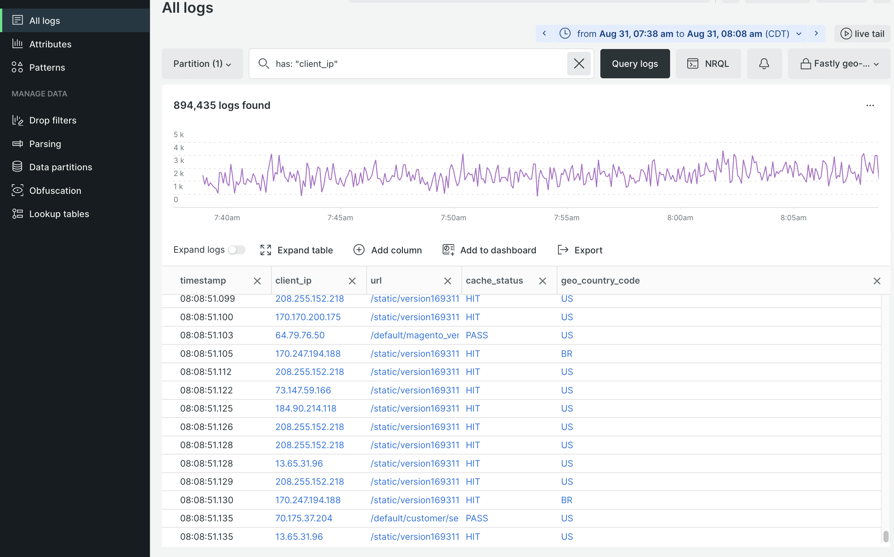

# New Relic logghantering

Alla molninfrastrukturprojekt innehåller [New Relic logghantering](https://docs.newrelic.com/docs/logs/get-started/get-started-log-management/). Tjänsten är förkonfigurerad för att samla alla loggdata från din miljö för förproduktion och produktion och visa dem i en centraliserad kontrollpanel för logghantering.

De aggregerade uppgifterna innehåller information från följande loggar:

- Alla `ece-tools` och programloggar från katalogen `~/var/log`
- Loggar för molntjänster från katalogen `var/log/platform/<project-ID>`
- Snabbt CDN och WAF

När ditt projekt är anslutet till New Relic kan du använda tjänsten New Relic Logs för att utföra följande uppgifter:

- Använd New Relic-frågor för att söka efter aggregerade loggdata
- Visualisera loggdata via programmet New Relic Logs
- Skapa egna diagram, kontrollpaneler och aviseringar
- Felsöka prestandaproblem från en enda kontrollpanel

## Visa och analysera loggdata

Använd programmet New Relic Logs för att söka i de samlade loggdata och felsöka program-, infrastruktur-, CDN- och WAF-fel. Du kan skapa diagram, kontrollpaneler och aviseringar med loggdata som samlats in från New Relic APM och infrastrukturtjänster.

**Så här använder du New Relic Logs-programmet**:

1. Logga in på ditt [New Relic-konto](https://login.newrelic.com/login).

1. Välj **Loggar** på menyn i Utforskaren.

1. Kontrollera att ditt konto är markerat högst upp i vyn _Alla loggar_.

1. Välj ett tidsintervall för loggfrågan.

1. Om du vill granska infrastrukturloggdata för molntjänster (loggar från `~/var/log/`) anger du frågesträngen `has: "filePath"` i fältet _Sök efter loggar_. Klicka sedan på **[!UICONTROL Query logs]**.

   Namnen på loggfilerna lagras i kolumnen `filePath`, med fullständiga sökvägar till loggfilen.

   

1. Om du snabbt vill granska loggdata anger du frågesträngen `has: "client_ip"` i fältet _Sök efter loggar_. Klicka sedan på **[!UICONTROL Query logs]**.

1. Om du vill filtrera loggresultaten snabbt efter landskod klickar du på **[!UICONTROL Add column]** och väljer sedan **[!UICONTROL geo_country_code]**.

   

>[!TIP]
>
>Du kan spara frågevyn i listrutan _Sparade vyer_. Klicka på **[!UICONTROL Create new]**, ange ett namn, välj alternativ och klicka på **[!UICONTROL Save view]**.
>
>Se [Kom igång med logghantering](https://docs.newrelic.com/docs/logs/get-started/get-started-log-management/) och [Introduktion till New Relic-frågespråket](https://docs.newrelic.com/docs/query-your-data/nrql-new-relic-query-language/get-started/introduction-nrql-new-relics-query-language/) på webbplatsen _New Relic Docs_.
