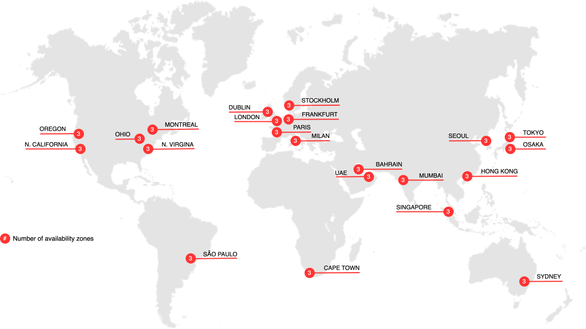

# Commerce on Cloud Infrastructure

Adobe Commerce i molninfrastruktur erbjuder en automatiserad värdplattform med en **självbetjäning** för att bygga, distribuera och hantera ditt [!DNL Commerce] -program i en molnbaserad miljö. Adobe Commerce i molninfrastrukturen har ytterligare funktioner som skiljer den från de lokala Adobe Commerce- och Magento Open Source-plattformarna:

- En företablerad infrastruktur som innehåller PHP, MySQL (MariaDB), Redis, [!DNL RabbitMQ] och sökmotortekniker som stöds.
- Git-baserat arbetsflöde med automatisk generering och driftsättning för effektiv snabb utveckling och kontinuerlig driftsättning varje gång du gör kodändringar i en Platform as a Service-miljö (PaaS).
- Konfigurationsfiler för mycket anpassningsbar miljö och verktyg för hantering och driftsättning via kommandoradsgränssnittet (CLI).
- Amazon Web Services (AWS) som erbjuder en skalbar och säker miljö för onlineförsäljning och webbutik.

>[!NOTE]
>
>Mer information om säkerhet finns i [checklistan för säkerhetsuppdatering](https://experienceleague.adobe.com/en/docs/commerce-on-cloud/user-guide/launch/checklist#security-configuration).

Visa [Teknikstacken](architecture/tech-stack.md) i detalj eller läs mer om specifika funktioner och produkter som stöds i [Cloud-arkitekturen för Commerce](architecture/cloud-architecture.md).

## Molnregioner

Följande avsnitt innehåller information om de olika AWS- och Azure-regionerna som är tillgängliga för Adobe Commerce i molninfrastrukturen.

## AWS

{zoomable="yes"}

>[!NOTE]
>
> Endast lokalt i Kina och Ryssland.

## Azure-regioner

{zoomable="yes"}

>[!NOTE]
>
> Endast lokalt i Kina och Ryssland. Alla handlare som kräver integreringsmiljöer måste använda USA-regioner.

## Adobe Commerce-dokumentation

I guiden för infrastruktur i molnet förutsätts det att du har en viss arbetskunskap och förståelse för Adobe Commerce program. Du kan läsa [!DNL Commerce] Developer and User guides nedan:

- [Adobe Commerce Developer Documentation](https://developer.adobe.com/commerce/docs/) (Adobe Developer webbplats) - Utveckla, anpassa, integrera, utöka och använda avancerade funktioner

- [Adobe Commerce Documentation](https://experienceleague.adobe.com/docs/commerce.html) (Adobe Experience League) - Planera, implementera, använd, uppgradera och underhåll dina [!DNL Commerce] -projekt
